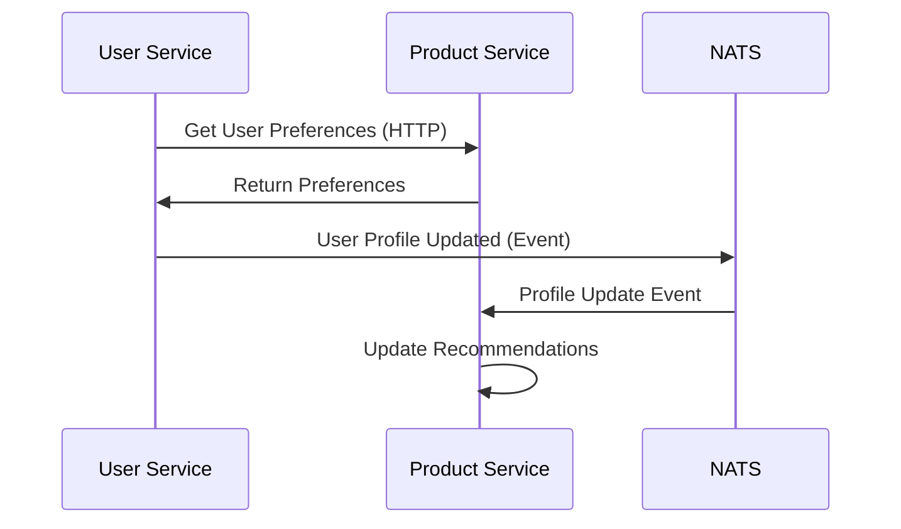
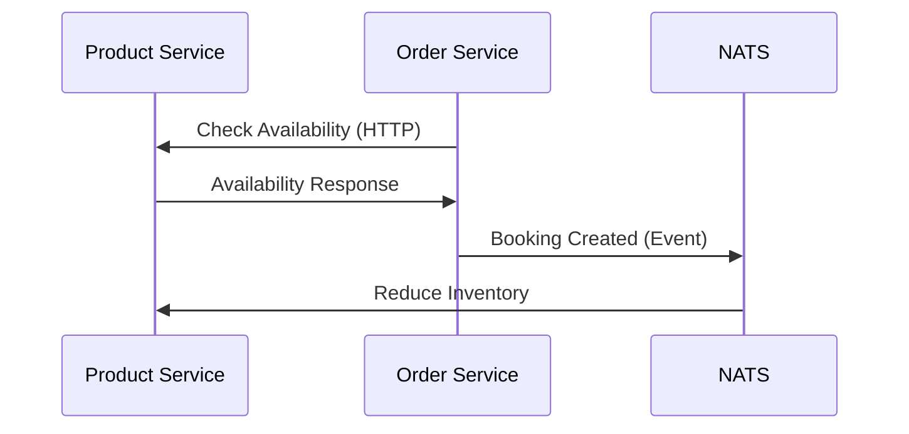

# Services Overview

## Service Architecture

Go Shop follows a microservices architecture where each service is responsible for a specific business domain. Services communicate through well-defined APIs and share infrastructure components.

## Current Services

### User Service
- **Status**: ✅ Active Development
- **Port**: 8100
- **Database**: user_db
- **Redis DB**: 0
- **Repository**: `services/user-service/`

#### Responsibilities
- User registration and authentication
- Profile management
- Password management
- User public profiles for collaboration

#### Key Features
- JWT-based authentication
- bcrypt password hashing
- Email and phone validation
- Clean Architecture implementation

#### API Endpoints
- `POST /register` - User registration
- `POST /login` - User authentication  
- `GET /profile` - Get user profile
- `PUT /profile` - Update user profile
- `POST /change-password` - Password change

#### Development
```bash
# Start user service
make dev-user

# View logs
make logs-user

# Access container
make shell

# Database migrations
make migrate-up
```

## Planned Services

### Product Service
- **Status**: 🔄 Planned
- **Port**: 8081
- **Database**: product_db
- **Redis DB**: 1
- **Repository**: `services/service-product/` (placeholder)

#### Planned Responsibilities
- Travel product catalog management
- Destination and activity listings
- Pricing and availability
- Product recommendations

#### Planned Features
- Product search and filtering
- Dynamic pricing
- Inventory management
- Integration with external providers

### Order Service
- **Status**: 📋 Future Planning
- **Port**: 8082
- **Database**: order_db
- **Redis DB**: 2

#### Planned Responsibilities
- Booking and reservation management
- Payment processing
- Order lifecycle management
- Integration with external booking systems

## Service Communication

### Synchronous Communication
- **Protocol**: HTTP/HTTPS with Connect-RPC
- **Format**: Protocol Buffers
- **Authentication**: JWT tokens
- **Load Balancing**: Via container orchestration

### Asynchronous Communication
- **Message Broker**: NATS JetStream
- **Patterns**: Event-driven architecture
- **Topics**: Domain-specific event streams
- **Delivery**: At-least-once delivery guarantees

### Communication Patterns

#### User-Product Service


#### Product-Order Service


## Shared Infrastructure

### Database Strategy
- **PostgreSQL Instance**: Single instance with multiple databases
- **Schema Isolation**: Each service owns its database schema
- **Connection Pooling**: pgx connection pools per service
- **Migration Management**: Independent migration per service

#### Database Access Patterns
```bash
# User Service Database
DATABASE_DB_NAME=user_db
# Tables: users, user_profiles, user_sessions

# Product Service Database  
DATABASE_DB_NAME=product_db
# Tables: products, categories, pricing

# Order Service Database
DATABASE_DB_NAME=order_db
# Tables: orders, bookings, payments
```

### Cache Strategy
- **Redis Instance**: Single instance with DB partitioning
- **Cache Keys**: Service-prefixed for namespace isolation
- **TTL Strategy**: Business-logic appropriate expiration
- **Cache Patterns**: Cache-aside, write-through

#### Cache Partitioning
```bash
# User Service (DB 0)
REDIS_DB=0
# Keys: user:profile:{id}, user:session:{token}

# Product Service (DB 1)
REDIS_DB=1  
# Keys: product:details:{id}, product:search:{query}

# Order Service (DB 2)
REDIS_DB=2
# Keys: order:cart:{user_id}, order:booking:{id}
```

### Message Broker
- **NATS JetStream**: Persistent message streaming
- **Stream Strategy**: Domain-specific streams
- **Consumer Groups**: Service-specific consumers
- **Retry Logic**: Exponential backoff with dead letter queues

## Development Guidelines

### Service Independence
1. **No Direct Database Access**: Services cannot access other service databases
2. **API Contracts**: Use Protocol Buffers for service interfaces
3. **Data Consistency**: Eventual consistency through events
4. **Testing**: Each service has independent test suites

### Inter-Service Communication
1. **Synchronous**: For immediate consistency requirements
2. **Asynchronous**: For eventual consistency and decoupling
3. **Circuit Breakers**: Prevent cascade failures
4. **Timeouts**: Set appropriate request timeouts

### Data Management
1. **Data Ownership**: Each service owns its data completely
2. **Shared Data**: Replicate through events when needed
3. **Transactions**: Single-service transactions only
4. **Saga Pattern**: For cross-service business transactions

## Monitoring and Observability

### Health Checks
```bash
# Check all services
make health

# Individual service health endpoints
curl http://localhost:8100/health  # User Service
curl http://localhost:8081/health  # Product Service (planned)
```

### Logging Strategy
- **Structured Logging**: JSON format with correlation IDs
- **Log Levels**: Debug, Info, Warn, Error
- **Log Aggregation**: Centralized logging (planned)
- **Correlation**: Request tracing across services

### Metrics Collection
- **Application Metrics**: Business and technical metrics
- **Infrastructure Metrics**: Resource utilization
- **Custom Metrics**: Service-specific KPIs
- **Alerting**: Based on SLA thresholds

## Security Considerations

### Authentication & Authorization
- **JWT Tokens**: Stateless authentication
- **Service-to-Service**: Internal API authentication
- **RBAC**: Role-based access control
- **Token Validation**: Shared validation logic

### Data Protection
- **Encryption at Rest**: Database encryption
- **Encryption in Transit**: TLS for all communications
- **Secrets Management**: Environment-based configuration
- **Data Sanitization**: Input validation and sanitization

### Network Security
- **Internal Network**: Services communicate via Docker network
- **External Access**: Only through API gateway (planned)
- **Rate Limiting**: Prevent abuse and DoS
- **CORS**: Controlled cross-origin requests

## Deployment Strategy

### Development Environment
- **Docker Compose**: Local development orchestration
- **Hot Reload**: Automatic code recompilation
- **Debug Support**: Remote debugging capabilities
- **Database Seeding**: Test data for development

### Production Considerations
- **Container Orchestration**: Kubernetes (planned)
- **Service Discovery**: DNS-based service resolution
- **Load Balancing**: Horizontal scaling support
- **Blue-Green Deployment**: Zero-downtime deployments